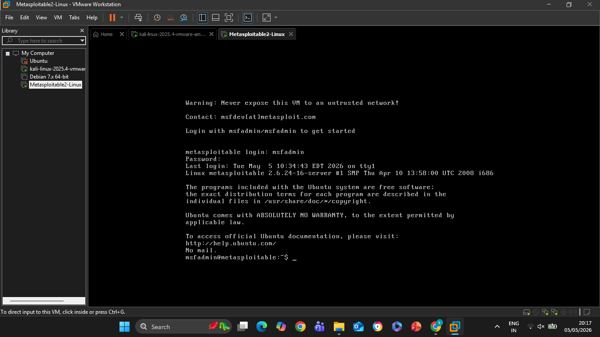
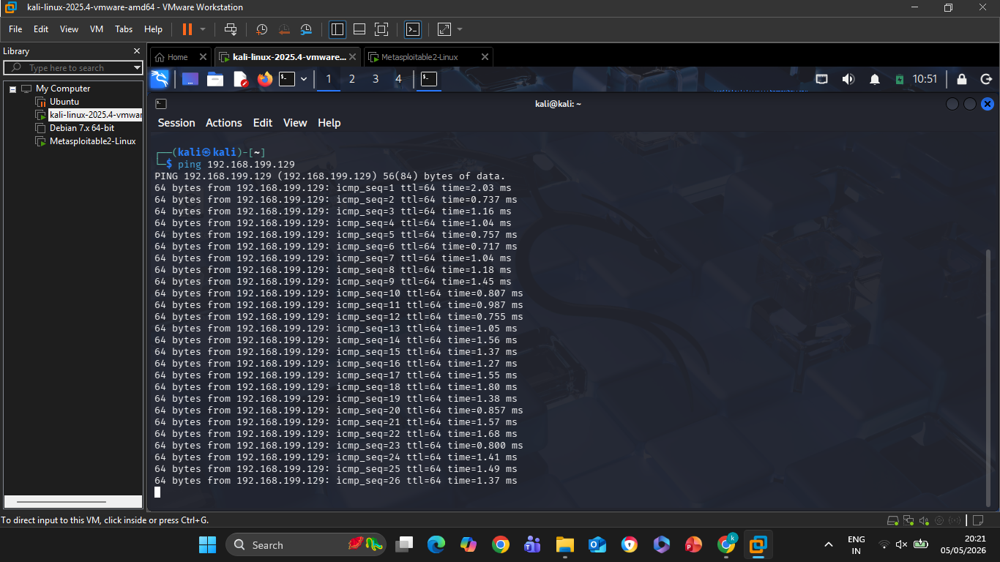
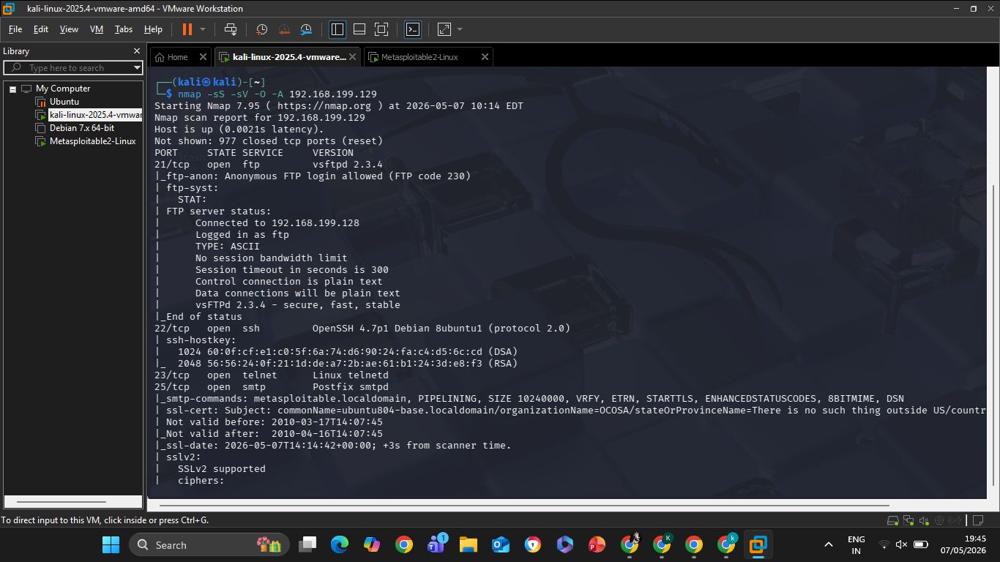
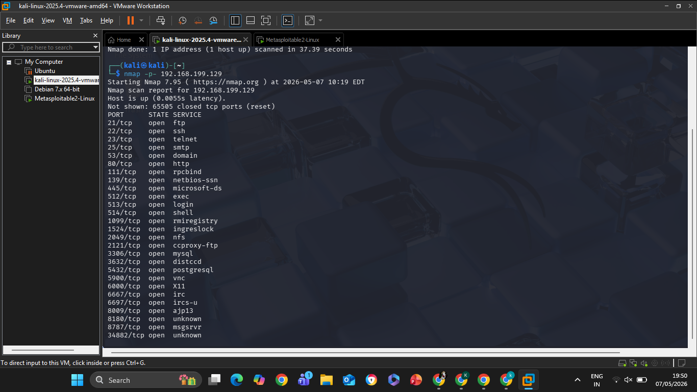
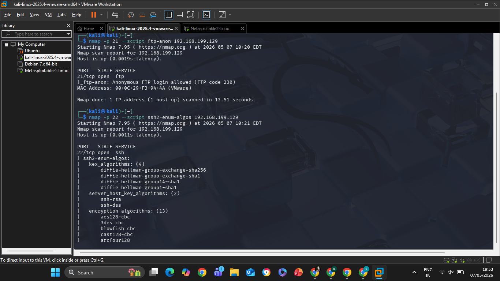
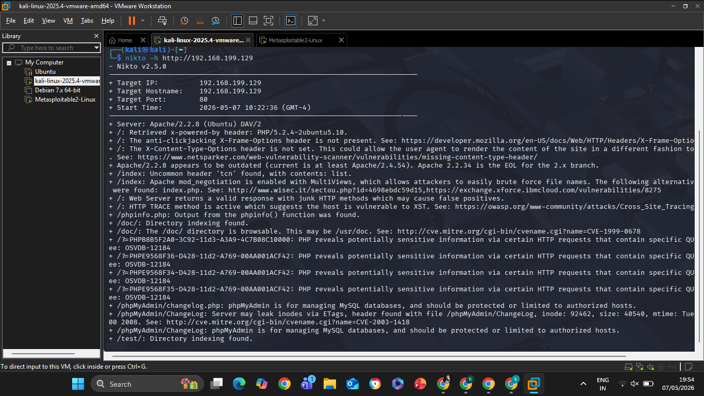

# Task-2: Vulnerability Scanning & Service Enumeration

## Student Details
- Name: Kalisetti Yogeswari
- Internship: Ethical Hacking & Penetration Testing Internship
- Course: B.Tech CSE (Cyber Security)

---
## Objective
The objective of this task is to perform vulnerability scanning and service enumeration on the Metasploitable2 virtual machine using Kali Linux and Nmap. This task helps in identifying open ports, active services, operating system details, and potential vulnerabilities in a controlled penetration testing environment.

---

## Tools Used
- Kali Linux
- Metasploitable2
- VMware Workstation
- Nmap
- Nikto

---

## Network Configuration
- Network Type: Host-only (VMnet1)
- IP Range: 192.168.199.xxx

---

## Commands Used

```bash
ping 192.168.199.129
```

```bash
nmap -sS -sV -O -A 192.168.199.129
```

```bash
nmap -p- 192.168.199.129
```

```bash
nikto -h http://192.168.199.129
```

---

## Open Ports Identified
- FTP (21)
- SSH (22)
- Telnet (23)
- SMTP (25)
- HTTP (80)
- NetBIOS (139)
- SMB (445)
- MySQL (3306)
- PostgreSQL (5432)
- VNC (5900)
- IRC (6667)
- Apache Tomcat (8180)

---

## Vulnerabilities Identified
- Anonymous FTP login enabled
- Telnet service active
- SMB service exposed
- Old Apache server version detected
- Multiple unnecessary open ports
- Outdated Linux kernel version

---

## Screenshots

### Lab Setup


### Ping Result


### Advanced Nmap Scan


### Open Ports & Services


### Vulnerability Scan


### Nikto Web Vulnerability Scan


---

## Report
[Download Report](./Task-2%20Vulnerability%20Assessment%20Report.pdf)
